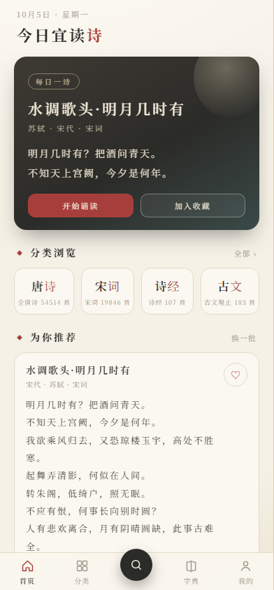
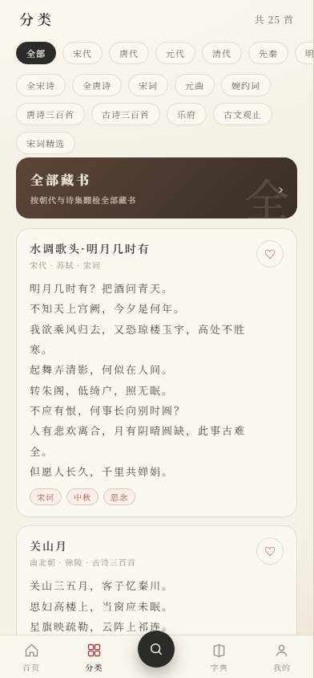
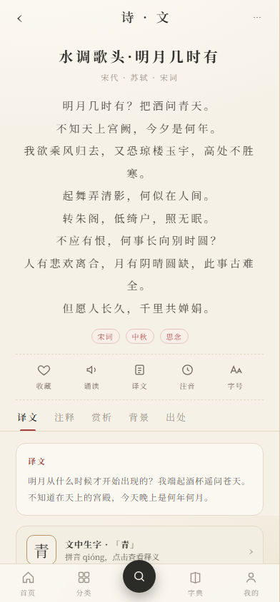
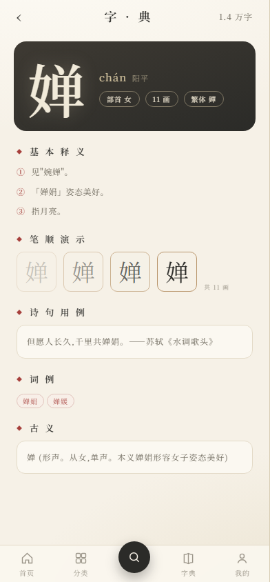

# 诗笺 · Poetry

一个离线的中国古典诗词阅读 App。水墨宣纸风格的界面，诗库随包分发、
完全离线可用，支持注音、诵读、收藏、打卡与汉字字典查询。

- 包名：`com.qoder.poetry`
- 版本：v1.0（`versionCode 1`）
- 平台：Android，minSdk 21 / targetSdk 34

<p align="center">
  
  
  
  
</p>

## 特性

- **离线诗库**：SQLite 数据库随包分发，无需联网；检索走索引，数十万篇规模下仍有响应。
- **十二分类**：唐诗三百首、宋词精选、古诗三百首、诗经、楚辞、乐府、
  古诗十九首、婉约词、豪放词、小学 / 初中 / 高中古诗文。
- **逐字注音**：正文可叠加拼音，支持逐字点击查看字义。
- **朗读诵读**：调用系统 TTS 朗读全篇。
- **详情多标签**：原文 / 注释 / 译文 / 赏析 / 背景切换，标签吸顶、局部刷新不跳顶。
- **无限滚动**：列表滚到底自动续拉，无「加载更多」按钮。
- **收藏与统计**：收藏夹、已读计数、查字计数、按天诵读量、连续打卡。
- **汉字字典**：内置新华字典数据，可查释义、拼音、部首。

## 架构

界面为 WebView 单页应用（`android/app/src/main/assets/web/`），
通过 `Bridge.java` 的 `@JavascriptInterface` 与原生层通信；数据访问在 `PoemRepository`，
统计在 `Stats`，字典查询在 `Zi` / `ZiSheet`。

## 目录结构

```
android/
  app/src/main/java/com/qoder/poetry/    原生层：WebView 宿主、Bridge、Repository、Stats、字典
  app/src/main/assets/web/               前端单页应用（index.html / app.css / app.js）
  app/src/main/assets/poems.db           运行时诗库（不入库，需自行生成）
  app/src/main/res/                      布局、drawable、主题与字符串资源
docs/                                    补充文档
preview/                                 界面截图
tools/                                   语料处理与建库脚本（Python）
  build_public.py                        chinese-poetry 公开语料 → data/public.raw.json
  build_db.py                            raw 语料 → android/app/src/main/assets/poems.db
  build_zi.py                            字典数据并入 poems.db 的 zi 表
  textutil.py                            跨脚本共用的文本清洗与去重签名
  check_db.py                            建库后的不变量门禁
  fetch.py / crawl_all.py / catalog.py / parse.py / parse_all.py / scale.py
                                          本地资料采集与解析（数据源自行指定）
data/                                    中间语料（大文件不入库，见 .gitignore）
poetry-app-prototype.html                高保真 UI 原型（六屏 + 色彩字体规范）
build.sh                                 本机构建入口
```

## 构建

要求 JDK 17 与 Gradle 8.13。

```bash
./build.sh assembleRelease     # 或 assembleDebug
```

`build.sh` 会调用本机已缓存的 Gradle 发行版，并把 `JAVA_HOME` 指向 `D:/Dev/jdk-17`；
如果本机路径不同，直接改这一行，或用 Android Studio 打开 `android/` 目录。

### 数据准备

`android/app/src/main/assets/poems.db` 体积较大（数百 MB，超过 GitHub 单文件上限），
**不随源码分发**，需要本地生成：

```bash
# 1) 导入 chinese-poetry 公开语料，产出 data/public.raw.json
python tools/build_public.py

# 2) 由 raw 语料生成运行时数据库
python tools/build_db.py

# 3) 把字典数据并入数据库的 zi 表
python tools/build_zi.py

# 4) （可选）校验数据库不变量
python tools/check_db.py
```

`tools/` 下另有采集与解析脚本，用于把使用者**自行准备**的本地资料
转成同样结构的 `data/poems.raw.json`；数据源地址通过环境变量给出，
仓库中不预设任何具体来源。相关版权边界请先阅读 [NOTICE.md](docs/NOTICE.md)。

### 签名

签名密钥与口令**不入库**。需要打签名包时，把 `release.keystore` 放到 `android/` 下，
并另建 `android/keystore.properties`（已被 `.gitignore` 排除）：

```properties
storeFile=release.keystore
storePassword=<口令>
keyAlias=<别名>
keyPassword=<口令>
```

未提供该文件时，`assembleRelease` 仍会成功，产出的是未签名包。

## 许可与版权

- **代码**：MIT，见 [LICENSE](LICENSE)。
- **语料**：诗的原文属公有领域，注释 / 译文 / 赏析等演绎内容版权归原作者所有，
  不在 MIT 范围内。详细说明与下架途径见 [NOTICE.md](docs/NOTICE.md)。
- 字典数据来自 [chinese-xinhua](https://github.com/pwxcoo/chinese-xinhua)（MIT），
  诗词正文语料来自 [chinese-poetry](https://github.com/chinese-poetry/chinese-poetry)（MIT）。
